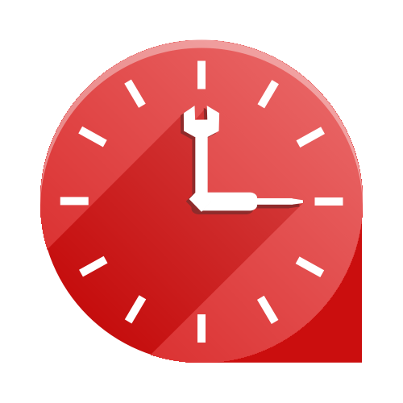
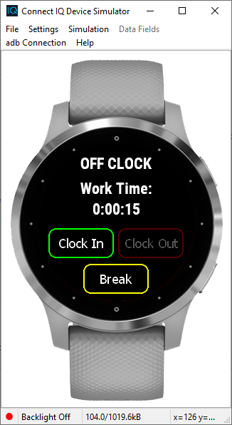
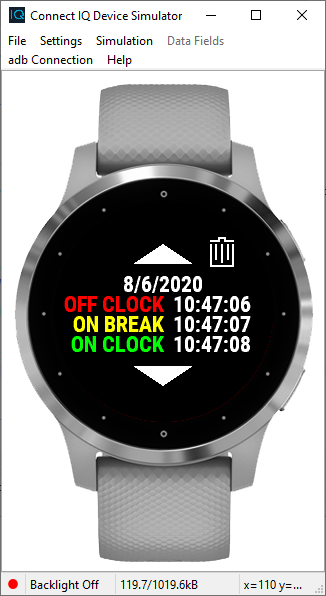
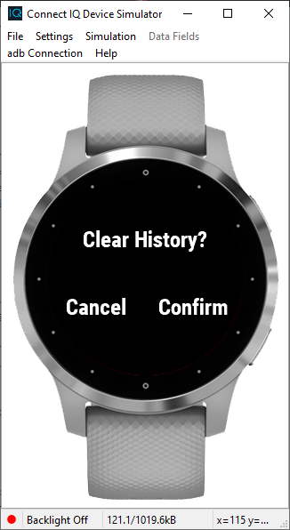

# Work Timer

## Overview:
This project is a Garmin Connect IQ watch app that allows you to keep track of your work time. One of the advantages of this app is that the app does not need to be running to keep track of time. (e.g. If you clock in, close the app, work for the entire day, open the app, and then clock out, the app will still accurately record your time). The project was begun as a submission for Garmin's Connect IQ Challange and is written in Monkey C.

## To Use:
This app has two main pages: Work Timer View and History View.

### Work Timer View:

Here there are three main fields. At the top is an indication which mode you are currently in: OFF CLOCK, ON CLOCK, and ON BREAK. Below that, the current time that you have been clocked in is displayed. This field is formatted as hr:min:sec. Days are not displayed, so the hour field will continue to increment even after 24 hours have elapsed. At the bottom of the display are three buttons corresponding to the three modes. Selecting one of these will activate the corresponding mode.

**Modes:**
* **OFF CLOCK:** work time will not be incrementing
* **ON CLOCK:** work time will be incrementing
* **ON BREAK:** work time will not be incrementing

**Controls:**
* **Touch-Enabled Devices:**
  * **Change Mode:** tap the button corresponding to the desired mode
  * **View History:** tap the displayed work time, or perform the menu action
* **Non-Touch-Enabled Devices:**
  * **Change Mode:** use the up and down buttons to cycle through the on-screen buttons and press the start/stop button to select the highlighted on-screen button
  * **View History:** select the displayed work time using the above method, or perform the menu action

### History View:

On this page, there are also three main fields. In the middle, the history of your work time is displayed. Here, headers are used for the date, and below that, the times at which you changed modes are displayed. If the list is too long to fit on the screen, on-screen up and down arrow buttons will appear. In the top right corner, a trash icon is provided that allows you to clear the history. Selecting this icon will bring up the confirmation dialog shown below. If there are no history entries, only the text "No History" will be displayed.

**Controls:**
* **Touch-Enabled Devices:**
  * **Navigate Through History:** tap the up and down arrow buttons or perform the previousPage and nextPage actions
  * **Clear History:** tap the trash icon in the upper right
  * **Cancel Clear:** tap "Cancel" or perform the back action
  * **Confirm Clear:** tap "Confirm"
  * **Return to Work Timer View:** perform the menu or back action
* **Non-Touch-Enabled Devices:**
  * **Scroll Through History:** press up and down buttons
  * **Clear History:** press start/stop button
  * **Cancel Clear:** press back button
  * **Confirm Clear:** press start/stop button
  * **Return to Work Timer View:** perform menu or back action

## Compatablity
This app is compatible with the following devices running Connect IQ 3.1 or greater.

**Disclaimer:** At this time, only the devices marked in **BOLD** have been tested. Additionally, these tests have only been conducted in the Connect IQ simulator and not on actual Garmin devices.

* Captain Marvel
* Darth Vader TM
* Edge® 1030
* Edge® 1030 Plus
* Edge® 1030, Bontrager
* Edge® 530
* Edge® 830
* **Edge® Explore**
* fēnix® 5 / quatix® 5
* fēnix® 5 Plus
* fēnix® 5S
* fēnix® 5S Plus
* fēnix® 5X / tactix® Charlie
* fēnix® 5X Plus
* fēnix® 6
* fēnix® 6 Pro / 6 Sapphire / quatix® 6
* fēnix® 6S
* fēnix® 6S Pro / 6S Sapphire
* fēnix® 6X Pro / 6X Sapphire / 6X Pro Solar / tactix® Delta Sapphire / quatix® 6X
* fēnix® Chronos
* First Avenger
* Forerunner® 245
* Forerunner® 245 Music
* Forerunner® 645
* Forerunner® 645 Music
* Forerunner® 935
* **Forerunner® 945**
* MARQ TM Adventurer
* MARQ TM Athlete
* MARQ TM Aviator
* MARQ® Captain / MARQ® Captain: American Magic Edition
* MARQ TM Commander
* MARQ TM Driver
* MARQ TM Expedition
* MARQ TM Golfer
* Rey TM
* vívoactive® 3 Music
* vívoactive® 3 Music LTE
* vívoactive® 4
* **vívoactive® 4S**

## To Build:
1. If you do not already have it, you will need the [Eclipse IDE](https://www.eclipse.org/) (see next step).
2. Follow the instructions [here](https://developer.garmin.com/connect-iq/programmers-guide/getting-started/) to install the Connect IQ SDK and create a new workspace.
3. Clone the repository and import the file into your workspace by going to **File > Import**. In the pop-up window go to **General > Existing Projects into Workspace**. In the same pop-up window, browse to the location that you cloned the project, check the checkbox for the Work Timer project, and select **Finish**.
4. Create a run configuration with a target device matching one in the list above and ensure that the target SDK version is "3.1.x".
5. You can now run the app in the simulator by running your run configuration.

## Known Bugs:
Currently none.

## Fixed Bugs:
* On non-touch-screen devices, if you highlight the Work Time button with the up and down buttons, press start/stop to enter history view, and then press back to return to work timer view, the Work Time button will still be highlighted but cannot be selected again until the up or down buttons are used. 
  * **Fix:** In WorkTimerDelegate.mc, force the History Button to :stateHighlighted if it is selected.
  
## ToDo:
* Build unit test suite
* Add support for more devices
* Possibly decrease the minimum SDK version required
* Reduce the number of calculations in the function TimeLogManager.getTimeWorked() in TimeLog.mc, so that only the most recent ON_CLOCK interval is calculated while the other intervals are stored in a variable

## Resources:
The developer page for Connect IQ can be found [here](https://developer.garmin.com/connect-iq/overview/). Additionally, their developer forum can be found [here](https://forums.garmin.com/developer/).
